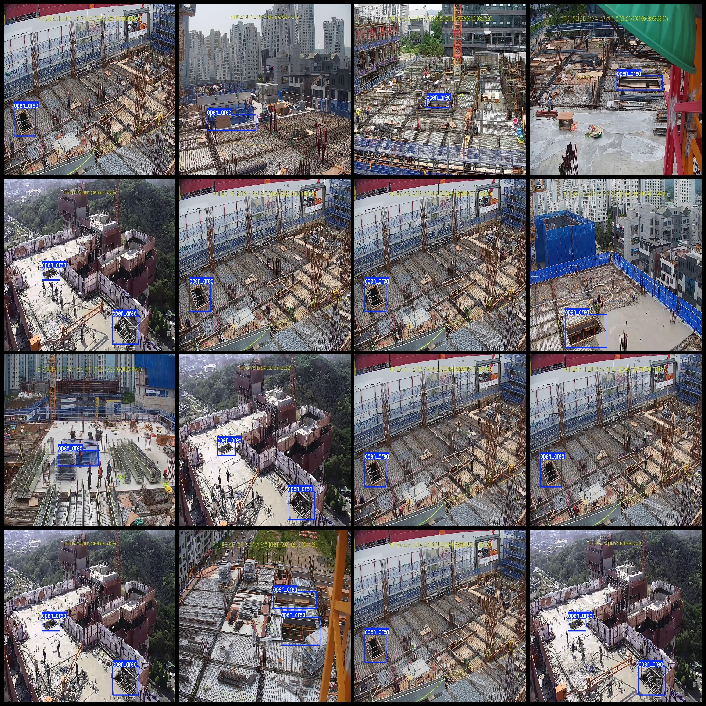
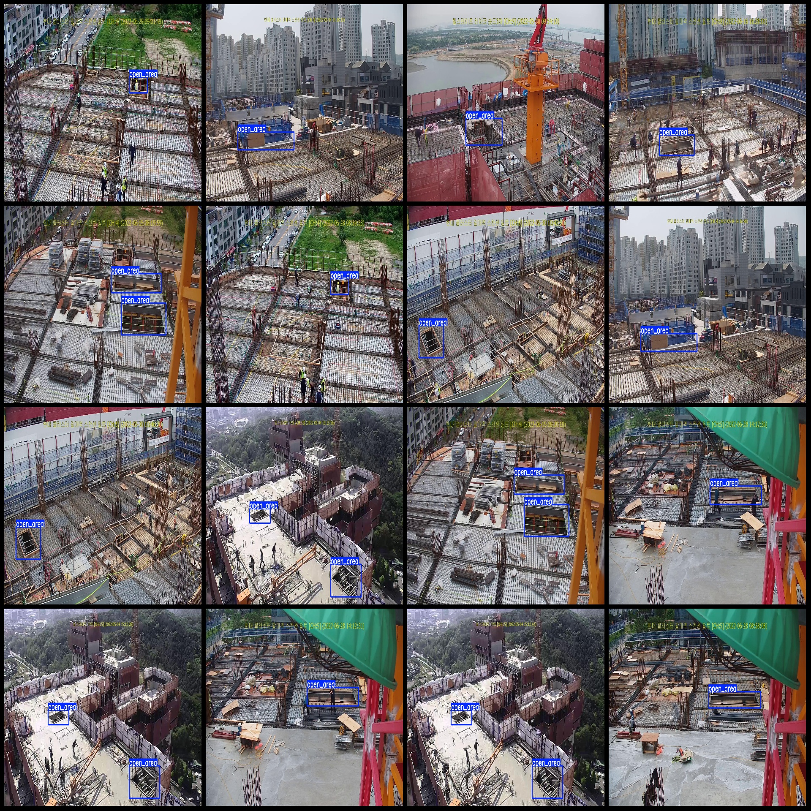

# Intelligent Construction Site, Open Area, and Hazard Detection Data Set (VOC+YOLO)

Dataset Format: Pascal VOC format + YOLO format (txt file without split path, only containing jpg images and corresponding VOC format xml files and yolo format txt files)

Number of Images (jpg file count): 941
Number of Annotations (xml file count): 941
Number of Annotations (txt file count): 941
Number of Annotation Categories: 1
Annotation Category Name: ["open_area"]
Number of Boxes per Category: 
open_area Boxes = 1228
Total Boxes = 1228
Number of Images per Category: 
open_area Images = 941
Image Resolution: 1920x1080
Annotation Tool Used: labelImg
Annotation Rules: Draw a box around the category
Special Notice: The dataset does not have a division into training/validation/test sets. Please divide them yourself.
Special Remark: This dataset does not guarantee the accuracy of the trained model or weight files.
Image Preview:

Annotation Example:

## Images

Here is a pay link on Stripe ( https://buy.stripe.com/3cs8yP7sY87d0vu9AB ). Please contact me lonlonago@foxmail.com after funding $89, and I will send you a complete data files , thank you!

